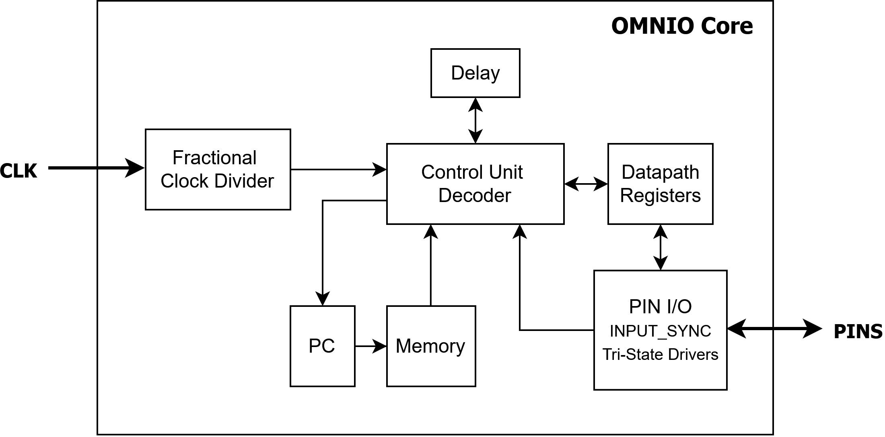

# ✨ OMNIO
OMNIO is a programmable I/O ASIC specialized for emulating digital protocols such as SPI, I2C, UART, and custom interfaces. Similar to the PIO state machines on the RP2040, it contains four small cores with an instruction set designed for reading/writing pins and counting cycles with precise enough timing that a real protocol can be implemented in firmware rather than a fixed block of logic.


<div align="center">
  <em>Figure 1: OMNIO Core Block Diagram</em>
  <br>
  <br>
</div>

The current microarchitecture plan (subject to change):
- 4 independent cores
- a shared memory array (at least 32x16 bits)
- input/output FIFOs
- fractional clock divider for slower protocols like UART with exact baud rates

The goal is to at least support the following protocols:
- UART, SPI, and I2C
- low-speed USB
- 10Mbit Ethernet

This project is being developed for the [Jane Street Protocol Emulator ASIC Competition](https://blog.janestreet.com/protocol-emulator-asic-competition/), targeting Tiny Tapeout on IHP's 130 nm CMOS5L process.

Deadline: January 18, 2027. Target shuttle: March 2027 CMOS5L.

## 🌟 Repository Structure
- `rtl`: Verilog source modules, including [`PROTOCOL_TOP.v`](rtl/PROTOCOL_TOP.v)
- `tools`: Python assembler
- `docs/decisions`: architecture decision records
- `tests`: SystemVerilog testbenches and Python assembler tests
- `tests/examples`: Assembly programs
- `asic`: ASIC flow configuration and constraints

## 📄 Instruction Set
|Instruction|Operation|
|-----------|----------------------------------|
|`SET`|Write the output pin register|
|`OE`|Set which pins are driven or released|
|`LDI`|Load the transmit shift register|
|`OUT`|Shift out one bit onto a selected pin|
|`LDX`|Load the loop counter|
|`DJNZ`|Decrement the loop counter, branch if it is nonzero|
|`IN`|Sample a selected pin into the receive shift register|
|`WAIT`|Wait for a selected input pin to reach a specified level|
|`JMP`|Jump to a program address|
|`HALT`|Stop execution until reset|

```
Datapath Registers:
X_REG = Loop counter. LDX loads count.
S_REG = Serial data transmit. Holds data being shifted out through the configured output pin.
RX_REG = Receive data. IN samples selected input pin(s) and places captured value here.
OE_REG = Output-enable. Controls whether each GPIO pin actively drives an output or not.
O_REG = Output value. Holds the values driven onto pins when OE_REG bit is enabled.
```

### Example: UART Transmission
This program transmits 0x96 on pin 0 using an 8N1 frame: one start bit, eight data bits sent LSB first, and one stop bit.
```
SET 1  # Drive pin 1 high
OE 1 [15]  # Make pin 1 an output; wait 15 cycles (16 cycles total)
LDI 0x96  # Load 0x96 into S_REG
LDX 8  # Load 8 into X_REG
SET 0 [15]  # Pull pin 1 low; wait 15 cycles (16 cycles total)
bit:
  OUT 0 [14]  # Output the next bit in S_REG 
  DJNZ bit  # Decrement X_REG; repeat until all 8 bits are sent
SET 1 [15]  # Drive pin 1 high; wait 15 cycles (16 cycles total)
HALT  # End of program
```

## ✔️ Verification and Testing
An FPGA is being used to test the RTL before the ASIC flow. Currently exploring formal methods, random constrained tests, and AI-assisted verification.

## 🎯 Personal Learning Outcomes
By the completion of this project, I should be able to:
- Translate system requirements into hardware architecture
- Design an instruction set based on the needs of real workloads, with both the microarchitecture and software in mind
- Implement SPI/I2C/UART receivers and transmitters using software-controlled I/O
- Write clean and modular Verilog RTL that others can easily understand
- Build a formal verification strategy and verify at multiple abstraction levels (individual modules, core, and the whole ASIC)
- Make quantitative PPA tradeoffs and design under real physical constraints
- Communicate hardware design documentation professionally (arch/timing diagrams, ISA documentation, decision documents, 

## ✍️ Author
**Jarnail Sanghera**

[Website](https://www.jarnailsanghera.com)

[LinkedIn](https://www.linkedin.com/in/jarnail-sanghera/)
